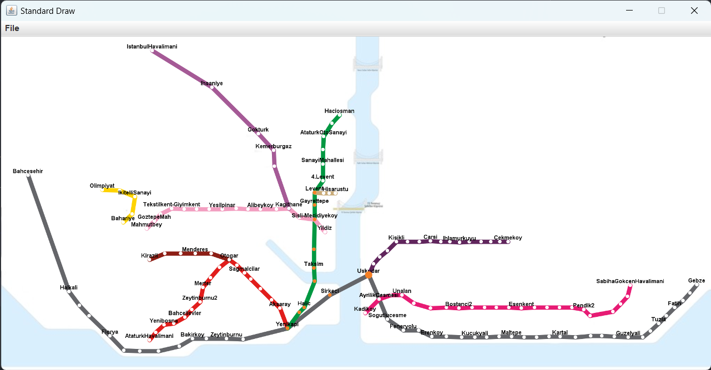
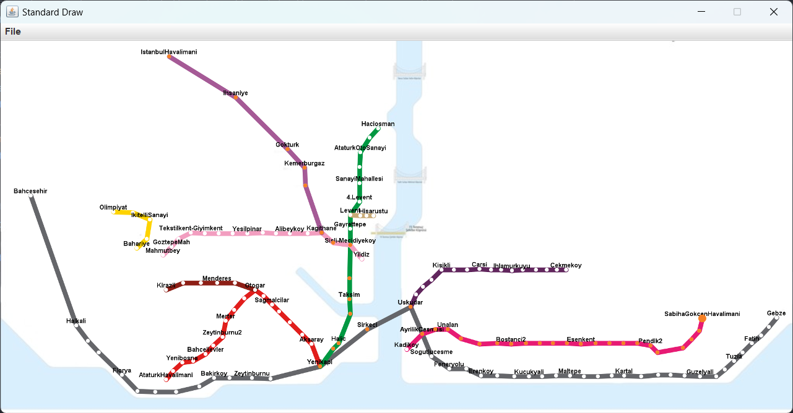

# CmpE160-Project1

## Explanation of the code

The program finds the path between two stations given as input. Then it shows the path from starting station to end station on the canvas using StdDraw. It also prints the path as station names on the path to the console.  
  
I first created a function to find all the possible stations we can travel from the current station in one move. In this function, I checked if the current station is in the list of break points, and if it is, I also considered the possible ways by switching to a different metro line.   
  
Then using this function mentioned above, I used “backtracking” algorithm with recursion to find the correct path between the stations. I basically tried to go to every possible station we can travel except the last visited one, and if it is a dead end, the function backtracks to the last choice of ways to go (probably a break point). Then, it chooses another way there. When it reaches the end station, it returns the solution as a string of station names each seperated by a space.  
  
Finally, it shows the path on the canvas. The current station is showed by a large orange point on it, and the stations we already passed are showed by a smaller orange point. I used 300ms for the pause duration as suggested. After each frame, I had to clear and redraw the background, lines and station names in order to make the points on the passed stations smaller compared to the current one.  

## Examples and outputs

Example 1:  
Input:  
Levent  
Uskudar  
  
Console Output:  
Levent  
Gayrettepe  
Sisli-Mecidiyekoy  
Osmanbey  
Taksim  
Sishane  
Halic  
Vezneciler  
Yenikapi  
Sirkeci  
Uskudar  
  
Canvas Output:

  
Example 2:  
Input:  
Aksaray  
Bahariye  
  
Console Output:  
These two stations are not connected  
  
Canvas Output:  
Canvas will not pop up.  
  
Example 3:  
Input:  
Bogazici  
Kadikoyyy  
  
Console Output:  
The station names provided are not present in this map.  
  
Canvas Output:  
Canvas will not pop up.  
  
Example 4:  
Input:  
IstanbulHavalimani  
SabihaGokcenHavalimani  
  
Console Output:  
IstanbulHavalimani  
Ihsaniye  
Gokturk  
Kemerburgaz  
Hasdal  
Kagithane  
Caglayan  
Sisli-Mecidiyekoy  
Osmanbey  
Taksim  
Sishane  
Halic  
Vezneciler  
Yenikapi  
Sirkeci  
Uskudar  
AyrilikCesmesi  
Acibadem  
Unalan  
Goztepe2  
Yenisahra  
Kozyatagi  
Bostanci2  
Kucukyali2  
Maltepe2  
Huzurevi  
Gulsuyu  
Esenkent  
Hastane-Adliye  
Soganlik  
Kartal2  
Yakacik  
Pendik2  
Tavsantepe  
FevziCakmak  
Yayalar  
Kurtkoy  
SabihaGokcenHavalimani  
  
Canvas Output:  

